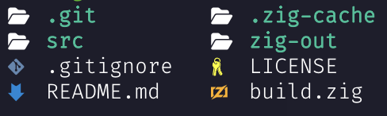

# ls+

`ls+` is a simple utility to replace the Unix utility `ls`.

Example of `ls+`:



Better than `ls` because:
- Outputs icons
- Formats output nicely
- Sorts directories at the top

Please ensure you are using a [Nerd Font](https://nerdfonts.com) in your terminal, and your terminal supports Truecolor.

## Installation

Perequisites:
- Zig Compiler

Run the following commands:

```sh
cd ~
git clone https://github.com/SolarFlurry/lsplus.git
cd lsplus
zig build --release=small
```

RECOMMENDED:
Add this to your `.zshrc` or `.bashrc`:
```sh
alias ls="~/lsplus/zig-out/bin/ls+"
```